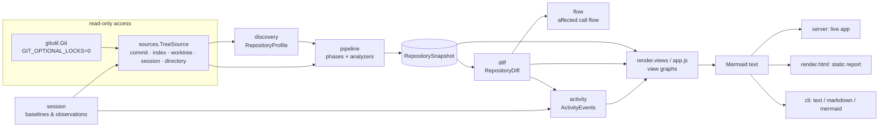

# Architecture



## Layers

| Module | Responsibility |
|---|---|
| `submodules` | What changed inside Git submodules between two states: pointer moves (commits, count, changed files, when the objects are local) and uncommitted files. Changed files keep their superproject path, so reviews treat them like any other file. `NestedSource` presents a superproject state plus its checked-out submodules (at the recorded commit, or their own working tree) for the analysis; `Repository.analysis_source` applies it when a snapshot is built, so reviews keep their plain sources and never count a file twice. Git runs inside submodules with the same hardened configuration. |
| `gitutil` | Read-only Git plumbing: `ls-tree`, `ls-files`, `cat-file --batch`, `status --porcelain=v2`, `merge-base`, `log`. Every call sets `GIT_OPTIONAL_LOCKS=0`; user revisions go through `rev-parse --verify --end-of-options`. |
| `sources` | `TreeSource` implementations: `GitRevisionSource` (commit), `GitIndexSource` (staged), `WorkingTreeSource` (tracked ± untracked), `OverlaySource` (session baseline), `FilesystemSource` (no Git). All content hashes are Git blob hashes, so files can be compared across states without reading them twice. |
| `classify`, `manifests`, `yamlish` | Tables and pure parsers for languages, manifests, lock files, containers, CI, deployment, docs, tests and generated code. |
| `discovery` | Builds a `RepositoryProfile` from one tree source, applying configuration overrides. |
| `analyzers` | Plugins that populate the graph (see below). |
| `pipeline` | Runs analyzers phase by phase, isolates failures as diagnostics, then assigns components, aggregates edges and detects cycles. |
| `model` | Normalized entities, independent of Mermaid and of languages. See [data-model.md](data-model.md). |
| `analyzers/runtime` | Run-time coupling found in code: images a module starts (`invokes-container`) and services it calls (`talks-to`), with constants resolved through imports, f-strings and `os.getenv` defaults (syntax trees only, never executed). |
| `services` | Compose files → services: one per name across a directory's variants, first-party or infrastructure (by image kind), what each runs, and `starts-after` / `talks-to` / `shares-volume` links. Used by discovery (entry points) and the manifest analyzer (nodes and edges). |
| `diff` | Compares two snapshots by stable IDs: statuses, reasons, cycles, and new or removed dependencies. |
| `flow` | Affected execution flow: changed symbols → callers → entry points and tests. |
| `session`, `activity` | Work-session baselines and current activity with impact analysis. |
| `review`, `wiring` | Review reports for agent work. `wiring` finds new code that nothing imports, registers or refers to. |
| `history` | Change coupling from Git history: for each file, the files that changed in most of its commits (one `git log`, cached per commit in `Repository.coupling`). |
| `render.views`, `render.mermaid` | View graphs and Mermaid serialization (the CLI and tests). |
| `web/app.js` | The browser app. It mirrors `render.views`/`render.mermaid` so filters work offline. |
| `server`, `render.html`, `cli` | The three front ends for people. |
| `mcp` | The front end for agents: a read-only MCP server over stdio (JSON-RPC, standard library only). See [mcp.md](mcp.md). |
| `ci` | SARIF, GitHub annotations and the pull-request comment, from a review report. |

## Analyzer interface

```python
class Analyzer:
    name = "mylang"
    version = "1"
    languages = ("mylang",)            # makes files of this language "supported"
    capabilities = ("modules", "dependencies", ...)

    def detect(self, ctx) -> Detection: ...            # applicable to this repository?
    def discover_components(self, ctx, b): ...
    def discover_modules(self, ctx, b): ...
    def discover_containment(self, ctx, b): ...
    def discover_symbols(self, ctx, b): ...
    def discover_entry_points(self, ctx, b): ...
    def discover_dependencies(self, ctx, b): ...
    def discover_calls(self, ctx, b): ...
    def finalize(self, ctx, b): ...
    def evidence(self, ctx, path, start, end, construct) -> SourceEvidence  # helper with excerpt
```

The pipeline runs **one phase at a time across all applicable analyzers**. Later
phases can therefore rely on what any analyzer produced earlier. For example,
the call-flow resolver works on symbols from the Python and JavaScript analyzers,
and the manifest analyzer's entry points are linked to Python callables.

- `ctx` (`AnalysisContext`) exposes the tree source, the discovery profile, the
  configuration, a per-file cache that survives across snapshots (keyed by
  content hash) and a `shared` dictionary for cross-analyzer data.
- `b` (`SnapshotBuilder`) creates and **merges** nodes by ID. The more specific
  type wins, and tags, analyzers and metadata are merged. Edges are deduplicated
  by `(relationship, source, target)`; occurrences count distinct source sites,
  and "only" flags (`type_checking_only`, `lazy_only`…) stay true only if every
  site has them. It also records diagnostics.
- An exception inside an analyzer becomes an `analyzer-failed` diagnostic;
  other analyzers are unaffected.
- New analyzers are registered with `repoviz.analyzers.register(cls)` or through
  the `repoviz.analyzers` entry-point group. Instances are created per snapshot,
  so they may keep state on `self`.

### Bundled analyzers

| Analyzer | Mandatory | Phases used |
|---|---|---|
| `filesystem` | yes | components (repository root, directories, files, roles), containment |
| `git` | yes (when Git is available) | components (branch/HEAD/default branch/remote names, shallow/detached diagnostics), finalize (churn) |
| `manifest` | – | components (projects, workspaces, containers, compose services, CI), entry points, dependencies (internal project graph, external packages) |
| `python` | – | modules, containment (packages/namespace packages), symbols + call index, entry points, dependencies (+ grimp cross-check) |
| `javascript` | – | modules, symbols + call index, dependencies |
| `go` | – | modules, symbols, dependencies |
| `callflow` | – | calls: resolves raw call sites and entry-point targets |

### Call-flow resolution

Language analyzers describe each module as a `ModuleScope`: local symbols,
import bindings (`name → (module, attribute path)`), sub-modules, star imports
and class bases. They also record raw call sites such as `helper()`,
`util.parse()`, `self.save()` or `super().close()`.

`CallIndex` resolves these through:
- enclosing scopes (nested functions),
- aliases and re-export chains across modules (`from .impl import helper as public_helper`),
- package sub-modules,
- class hierarchies for `self`/`super()` calls,
- class instantiation (→ `__init__`/`constructor`).

Anything else (calls through objects, dynamic dispatch, external libraries) is
counted as unresolved rather than guessed.

## Identifiers

IDs are BLAKE2b hashes (80 bits) of length-prefixed canonical keys, for example
`file_<hash>` for `path:file:src/a.py` and `sym_<hash>` for
`symbol:src/a.py:Cls.meth`. So:

- the same entity has the same ID in every snapshot, which is what makes diffs
  possible;
- keys that differ only in punctuation (`a/b_c` vs `a_b/c`) never collide;
- IDs are valid Mermaid identifiers.

`IdRegistry` detects collisions within a snapshot and falls back to 128 bits.

## Components and aggregation

Each module/file gets `metadata.component_id`, the first match of:

1. an explicitly configured component whose `paths` match;
2. the outermost enclosing **test root** (so test packages don't each become a
   component);
3. the innermost ancestor tagged `component`: a top-level Python package, a
   project/workspace member, a Go module or an npm package;
4. the top-level directory;
5. the repository root.

`metadata.project_id` is the innermost directory with a project manifest. The
UI aggregates edges at the module, package (parent directory/package),
component or project level. "Auto" picks the coarsest level that still shows at
least four nodes.

## Cycles

Strongly connected components (iterative Tarjan) are computed for:

- module-level `imports`,
- component-level aggregated imports,
- project-level `depends-on` (excluding dev/test scopes).

By default `TYPE_CHECKING`-only imports are excluded and lazy imports included
(both configurable). Diffs match cycles by member overlap:
**introduced**, **resolved**, or **changed** (members added or removed). Every
edge records whether it is in a cycle in the base and in the target.

## Caching and performance

- Per-file parse results are cached by content hash, so comparing HEAD with the
  working tree only re-parses changed files.
- Snapshots are cached by `(source kind, revision id, config)`. A working-tree
  revision ID is a digest of its files' hashes, computed from a stat-keyed cache.
- Python files are parsed in a process pool for large batches (disable with
  `REPOVIZ_NO_PARALLEL=1`).
- Embedded report data is compacted and gzip-compressed above 1.5 MB. The UI
  inflates it with the browser's `DecompressionStream`. Live responses use the
  same compaction.
- Diffs are cached by the revision IDs of both sides. Concurrent requests for the
  same snapshot or diff compute it once ("single flight").
- The live server serializes only writes to the state directory. Analysis
  requests run concurrently, so a slow review does not block assets, the
  activity poll or small API calls.
- `observe()` returns an `etag` derived from the baseline, the working-tree
  revision ID and `git status`. The activity poll sends `If-None-Match` and gets
  `304 Not Modified` while nothing changes, so polling costs one status check
  and no re-serialization or re-rendering.
- Review reports are cached per target, revisions and scope. Notes are loaded
  fresh and spliced into the cached JSON.

For scale: Django (≈2,800 modules, 39k symbols) takes about 8 s for the first
snapshot and 0.1 s for a cached one.

## Web application

`index.html`, `app.css` and `app.js` are shared by both modes. The live page
fetches `/api/*`; the static report inlines Mermaid, the script and a
`<script type="application/json">` payload (with `<` escaped as `<`). The
app builds view graphs, serializes them to Mermaid, renders with
`securityLevel: "strict"`, then attaches its own pan/zoom, keyboard and click
handlers to the SVG.

Two interactions work on the rendered SVG without drawing it again, so the
layout, zoom and pan stay where they are:

- **Spotlight (Dependencies).** Clicking a node adds classes to the SVG
  elements that are already there: the node is focused, its inbound and
  outbound neighbours and links stand out, and the rest is dimmed. Inbound
  links are solid, outbound links dashed, and a status line gives the counts.
- **Code changes (Structure).** Clicking a churn hotspot (a module at or above
  the 80th percentile of recent commits, changed at least twice) opens a drawer under the diagram. The
  drawer shows the file's last commits and the diff of one of them, with an
  explicit `+` / `−` marker on every changed line.
  - `filechanges.py` reads only that file: a `git log --literal-pathspecs` for
    the file, `git cat-file` for its two versions, and the disk for the working
    copy (never through a symbolic link).
  - A click stays fast on large repositories.
  - Subjects and diff lines are redacted.
  - Static reports embed the latest change of the 25 busiest hotspots, capped
    at 300 lines per file and 6,000 in total, with a "truncated for report
    size" notice.
  - Esc or × closes the drawer and puts the focus back on the selected node.

Large diagrams (`Diagram` in `app.js`, mirrored by `render/views.py` for the
CLI):

- **Orientation.** Before drawing, `chooseDirection` (`views.choose_direction`)
  ranks the view graph by longest path. It estimates the drawing both ways (ranks
  × 250 px by the widest rank × 56 px left to right; the widest rank × 190 px by
  ranks × 116 px top to bottom). The view keeps its own direction unless the
  other one fits the viewport at a zoom at least 1.25× larger (`ORIENT_GAIN`), so
  borderline shapes don't flip. A view with `orientable: false` (nested boxes,
  layers) is never turned. The ⇄ / ⇅ override is stored per tab under
  `rv.orient.<tab>`, or under the view's own `orientKey` (`rv.orient.system`).
- **Fit** measures the label font size and never scales below 11 px. A larger
  diagram fits its width and is panned. When it is more than twice the view at
  that zoom, a mini-map (the node boxes, not a copy of the SVG) shows the visible
  area and moves the view on click.
- **Folds.** `structureView` (`views.structure_view`, `fold=`) replaces more than
  8 leaves of one kind under one parent (test, docs, module, file) with a node
  `fold_<parent>_<kind>`. `view.folds` records them. The selection, find matches
  and files in the activity report never go into a fold. A click on a fold adds it
  to the tab's unfolded set and redraws.
- **Existing cycles.** `changesView` / `views.changes_view` mark a cycle edge
  `cycleExisting` / `cycle_existing` when no member of its strongly connected
  component changed. It is drawn thin, dotted and at half opacity, with the SVG
  class `cycle-existing`. The other cycles get `cycle-new` or `cycle-kept`.
- **Labels** longer than 40 characters are middle-truncated. Each node carries
  an SVG `<title>` with the full name.

Long lists use one table helper (`table()` in `app.js`). Besides sorting and
"Show more", it offers a search box, facet chips with counts, and collapsible
groups with per-group totals. A group can be headed by one of its rows (a
submodule heads its inner files). Only the visible rows reach `onOrder`, so
keyboard navigation skips collapsed groups. The query, chips, grouping and
collapsed groups are saved per list (`rv.list.review`, `rv.list.changes`)
through the storage wrapper, which ignores browsers that refuse storage.

Icons are defined once in `app.js` as SVG path data: 24×24, 2px round strokes,
plus a light-background and a dark-background colour per icon. At startup they
become a stylesheet in which each `.rvi-<name>` class paints its icon with a CSS
mask (`data:` URI, allowed by the CSP). Mermaid labels contain only a short
`<i class='rvi rvi-folder'></i>` token. The strict sanitizer keeps it, and
Mermaid sizes the node with the icon's width because page CSS applies while it
measures. Icons inside nodes keep their light-theme colours (node fills stay
light in both themes). *SVG* downloads embed the icon stylesheet.

Server endpoints:

| Endpoint | Description |
|---|---|
| `GET /api/bundle` | profile, revisions, working-tree snapshot, theme |
| `GET /api/diff?mode=all\|staged\|unstaged\|session\|merge-base&base=&target=&spec=` | a comparison |
| `GET /api/snapshot?rev=` | any snapshot |
| `GET /api/activity` | activity report with diff and affected flow |
| `GET /api/revisions`, `/api/profile`, `/api/health` | metadata |
| `GET /api/file/changes?path=[&commit=SHA\|WORKTREE]` | one file's last commits (newest first) and the diff of one of them (by default its uncommitted edits, else its latest commit); used by the Structure tab's *Code changes* drawer |
| `GET /api/review/targets`, `/api/review?id=\|base=&target=[&mode=merge-base\|exact][&commit=SHA\|WORKTREE]`, `/api/review/notes?key=` | AI review (`mode`: since the two diverged, or the exact difference; `commit`: one step of the range, reviewed alone) |
| `POST /api/session/start`, `/api/session/end`, `/api/session/scope`, `/api/review/notes` | state changes |

Every `/api/*` request must carry `X-Repoviz: 1`. Browsers can't add that
header to a cross-site request without a CORS preflight, which the server never
grants. Other origins therefore can neither trigger side effects nor read
responses. The Host header is checked against loopback names (DNS rebinding),
and the CSP forbids inline and evaluated script.

Git hardening: `.git/config` belongs to whoever produced the repository, so
`gitutil.Git` passes `-c` overrides with every command. These cover
`core.fsmonitor=false`, empty clean/smudge/process commands for every
configured filter driver, `log.showSignature=false` and
`core.hooksPath=/dev/null`. `git status` also runs with
`--ignore-submodules=dirty`, so it never starts git inside submodules.
