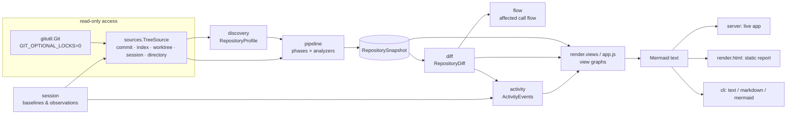

# Architecture


```mermaid
flowchart LR
  subgraph Read["read-only access"]
    git[gitutil.Git<br/>GIT_OPTIONAL_LOCKS=0] --> src[sources.TreeSource<br/>commit · index · worktree · session · directory]
  end
  src --> disc[discovery<br/>RepositoryProfile]
  disc --> pipe[pipeline<br/>phases × analyzers]
  src --> pipe
  pipe --> snap[(RepositorySnapshot)]
  snap --> diff[diff<br/>RepositoryDiff]
  diff --> flow[flow<br/>affected call flow]
  diff --> act[activity<br/>ActivityEvents]
  sess[session<br/>baselines & observations] --> src
  sess --> act
  snap & diff & act --> views[render.views / app.js<br/>view graphs] --> mm[Mermaid text]
  mm --> live[server: live app]
  mm --> report[render.html: static report]
  mm --> cli[cli: text / markdown / mermaid]
```

## Layers

| Module | Responsibility |
|---|---|
| `submodules` | What changed inside Git submodules between two states: pointer moves (commits, count, changed files, when the objects are local) and uncommitted files. Changed files keep their superproject path, so reviews treat them like any other file. `NestedSource` presents a superproject state plus its checked-out submodules (at the recorded commit, or their own working tree) for the analysis; `Repository.analysis_source` applies it when a snapshot is built, so reviews keep their plain sources and never count a file twice. Git runs inside submodules with the same hardened configuration. |
| `gitutil` | Read-only Git plumbing: `ls-tree`, `ls-files`, `cat-file --batch`, `status --porcelain=v2`, `merge-base`, `log`. Every call sets `GIT_OPTIONAL_LOCKS=0`; user revisions go through `rev-parse --verify --end-of-options`. |
| `sources` | `TreeSource` implementations: `GitRevisionSource` (commit), `GitIndexSource` (staged), `WorkingTreeSource` (tracked ± untracked), `OverlaySource` (session baseline), `FilesystemSource` (no Git). All content hashes are Git blob hashes, so files can be compared across states without reading them twice. |
| `classify`, `manifests`, `yamlish` | Tables and pure parsers for languages, manifests, lock files, containers, CI, deployment, docs, tests and generated code. |
| `discovery` | Builds a `RepositoryProfile` from one tree source, applying configuration overrides. |
| `analyzers` | Plugins that populate the graph (see below). |
| `pipeline` | Runs analyzers phase by phase, isolates failures as diagnostics, then assigns components, aggregates edges and detects cycles. |
| `model` | Normalized entities, independent of Mermaid and of languages. See [data-model.md](data-model.md). |
| `analyzers/runtime` | Run-time coupling found in code: images a module starts (`invokes-container`) and services it calls (`talks-to`), with constants resolved through imports, f-strings and `os.getenv` defaults (syntax trees only, never executed). |
| `services` | Compose files → services: one per name across a directory's variants, first-party or infrastructure (by image kind), what each runs, and `starts-after` / `talks-to` / `shares-volume` links. Used by discovery (entry points) and the manifest analyzer (nodes and edges). |
| `diff` | Compares two snapshots by stable IDs: statuses, reasons, cycles, and new or removed dependencies. |
| `flow` | Affected execution flow: changed symbols → callers → entry points and tests. |
| `session`, `activity` | Work-session baselines and current activity with impact analysis. |
| `review`, `wiring` | Review reports for agent work. `wiring` finds new code that nothing imports, registers or refers to. |
| `history` | Change coupling from Git history: for each file, the files that changed in most of its commits (one `git log`, cached per commit in `Repository.coupling`). |
| `render.views`, `render.mermaid` | View graphs and Mermaid serialization (the CLI and tests). |
| `web/app.js` | The browser app. It mirrors `render.views`/`render.mermaid` so filters work offline. |
| `server`, `render.html`, `cli` | The three front ends for people. |
| `mcp` | The front end for agents: a read-only MCP server over stdio (JSON-RPC, standard library only). See [mcp.md](mcp.md). |
| `ci` | SARIF, GitHub annotations and the pull-request comment, from a review report. |

## Analyzer interface

```python
class Analyzer:
    name = "mylang"
    version = "1"
    languages = ("mylang",)            # makes files of this language "supported"
    capabilities = ("modules", "dependencies", ...)

    def detect(self, ctx) -> Detection: ...            # applicable to this repository?
    def discover_components(self, ctx, b): ...
    def discover_modules(self, ctx, b): ...
    def discover_containment(self, ctx, b): ...
    def discover_symbols(self, ctx, b): ...
    def discover_entry_points(self, ctx, b): ...
    def discover_dependencies(self, ctx, b): ...
    def discover_calls(self, ctx, b): ...
    def finalize(self, ctx, b): ...
    def evidence(self, ctx, path, start, end, construct) -> SourceEvidence  # helper with excerpt
```

The pipeline runs **one phase at a time across all applicable analyzers**. Later
phases can therefore rely on what any analyzer produced earlier. For example,
the call-flow resolver works on symbols from the Python and JavaScript analyzers,
and the manifest analyzer's entry points are linked to Python callables.

- `ctx` (`AnalysisContext`) exposes the tree source, the discovery profile, the
  configuration, a per-file cache that survives across snapshots (keyed by
  content hash) and a `shared` dictionary for cross-analyzer data.
- `b` (`SnapshotBuilder`) creates and **merges** nodes by ID. The more specific
  type wins, and tags, analyzers and metadata are merged. Edges are deduplicated
  by `(relationship, source, target)`; occurrences count distinct source sites,
  and "only" flags (`type_checking_only`, `lazy_only`…) stay true only if every
  site has them. It also records diagnostics.
- An exception inside an analyzer becomes an `analyzer-failed` diagnostic;
  other analyzers are unaffected.
- New analyzers are registered with `repoviz.analyzers.register(cls)` or through
  the `repoviz.analyzers` entry-point group. Instances are created per snapshot,
  so they may keep state on `self`.

### Bundled analyzers

| Analyzer | Mandatory | Phases used |
|---|---|---|
| `filesystem` | yes | components (repository root, directories, files, roles), containment |
| `git` | yes (when Git is available) | components (branch/HEAD/default branch/remote names, shallow/detached diagnostics), finalize (churn, author counts, a commit sparkline) |
| `manifest` | – | components (projects, workspaces, containers, compose services, CI), entry points, dependencies (internal project graph, external packages) |
| `python` | – | modules, containment (packages/namespace packages), symbols + call index, entry points, dependencies (+ grimp cross-check) |
| `javascript` | – | modules, symbols + call index, dependencies |
| `go` | – | modules, symbols, dependencies |
| `jvm` | – | modules (Java and Kotlin; package folders), symbols, entry points, dependencies (imports, same-package uses, fully qualified names; externals mapped to Maven/Gradle artifacts). See [below](#java-and-kotlin) |
| `dotnet` | – | modules (C#; namespace folders), symbols, entry points, dependencies (usings resolved to the types used, enclosing namespaces, global usings, extension methods; externals mapped to NuGet packages). See [below](#c) |
| `rust` | – | modules (the module tree of every crate), symbols, entry points, dependencies (use trees and paths resolved down the tree; externals mapped to Cargo dependencies). See [below](#rust) |
| `php` | – | modules (namespace folders), symbols, entry points, dependencies (imports, class names in code, PSR-4, require / include; externals mapped to Composer packages). See [below](#php) |
| `ruby` | – | modules, symbols, entry points, dependencies (constants resolved through the lexical nesting, requires through the load paths; externals mapped to gems). See [below](#ruby) |
| `cfamily` | – | modules (files), symbols, entry points, dependencies (`#include` through the include directories of CMake, Make, Meson and Bazel; standard, system and `find_package` externals). See [below](#c-and-c) |
| `runtime` | – | calls: containers the code starts and services it calls (`invokes-container`, `talks-to`); finalize: their service-to-service copies |
| `interfaces` | – | calls: HTTP routes, background tasks and environment variables, and the code that calls, enqueues or reads them |
| `callflow` | – | calls: resolves raw call sites and entry-point targets |
| `metrics` | – | finalize (last): size, complexity, fan-in / fan-out, hotspots, rolled up to folders (see [data-model.md](data-model.md#health-metrics)) |

### Java and Kotlin

The `jvm` analyzer reads text only (`analyzers/textscan.py` blanks comments and
string contents with one regular expression per language, and braces give the
nesting), so it never needs a JDK or a build.

- **Modules.** One per file: `package` + file name (`com.acme.web.OrderController`).
  A folder whose files declare one package becomes a `package` node with that name.
- **Resolution.** An index of the top-level types (and Kotlin top-level functions
  and properties) of every package. `import a.b.C.Inner` and `import static
  a.b.C.m` resolve to the file of `a.b.C`. `import a.b.*` links only the types of
  `a.b` the file uses. Java and Kotlin need no import for their own package, so
  a type (or, in Kotlin, a function call) of the same package used in the code is
  an `imports` edge too, with `same_package: true` and construct `same-package`
  (confidence 0.85, 0.7 for a function name). A fully qualified name in code
  (`com.acme.util.Strings.join(…)`) is construct `qualified-name`. When several
  files declare a name (two Maven modules, Kotlin multiplatform `expect` /
  `actual`), the one sharing the longest path with the importing file wins, then
  `commonMain`.
- **External packages.** `java.*`, the JDK's `javax.*` packages, `jdk.*`,
  `kotlin.*`, `android.*` and Kotlin/Native `platform.*` are standard (named by
  their first two segments). Others are matched to a declared Maven / Gradle
  artifact: the longest shared prefix with its groupId (at least two segments),
  then the words of the artifactId found in the package
  (`com.fasterxml.jackson.databind` → `jackson-databind`, `kotlinx.coroutines` →
  `kotlinx-coroutines-core`). A tie or no match names the external by its first
  three package segments (`org.junit.jupiter`).
- **Broken imports.** A missing type from a package that exists in the repository
  is `unresolved-internal-import` (a *Broken import* signal when new). Names that
  build tools generate into the project's packages are not: `R`, `BuildConfig`,
  `Dagger…`, `Hilt_…`, `AutoValue_…`, `Q…` (QueryDSL), `…_` (JPA metamodel),
  `…Binding`, `…Proto`, `…OuterClass`, `…Grpc`, `…MapperImpl`, `…Builder`. Other
  imports under the repository's own package root that match nothing are counted,
  not reported.
- **Symbols.** Classes, interfaces, enums, records, annotations and Kotlin
  objects (nested too), methods, constructors and Kotlin functions (extension
  functions keep their receiver), with a signature (`(String filter, int page) ->
  List<Order>`, `(o: Order): String`) and `public` (Java `public` / `protected`,
  Kotlin anything but `private` / `internal`). Overloads carry their parameter
  types in the name (`list(String, int)`). Members of anonymous classes, enum
  constant bodies and local classes are not symbols.
- **Not done.** No call graph (the Activity tab uses import impact), no
  `unwired-module` check (frameworks load Java classes by annotation), and Kotlin
  type aliases are not resolved. Build scripts (`build.gradle.kts`) are
  configuration, not modules.

### C#

The `dotnet` analyzer works like the `jvm` one (text only, comments and string
contents blanked, including verbatim `@"…"` and raw `"""…"""` strings), with the
rules of C# name lookup:

- **Modules.** One per `.cs` file: namespace + file name
  (`Shop.Web.Controllers.OrdersController`). File-scoped (`namespace X;`) and
  block namespaces, nested ones included. A folder whose files declare one
  namespace becomes a `package` node with that name.
- **What a file sees.** Its own namespaces and every enclosing one
  (`Shop.Web.Controllers` sees `Shop.Web` and `Shop`), its `using` directives,
  and the `global using` directives of its project (the nearest `.csproj`).
  `using A.B;` names a namespace, so an edge goes to the files of the types of
  `A.B` the file uses (construct `using`, evidence on the using line;
  `global-using` with the evidence in the file declaring it), or, when a
  static class of `A.B` declares extension methods the file calls
  (`services.AddShopCore()`), to that file (`extension-method`). Types of the
  own and enclosing namespaces are `same-namespace` (`same_package: true`).
  `using static A.B.C;` and `using X = A.B.C;` link the file of `C`. An
  attribute `[Audited]` is the type `AuditedAttribute`.
- **PascalCase members.** A property or method named like a type (`public
  string Name { get; set; }`) is not a use of the type `Name`, unless the name
  also stands where only a type can (`new Name(…)`, `Name x`, `Name?`,
  `<Name>`, `typeof(Name)`, `is` / `as`, a base list, a cast, an attribute).
- **External namespaces.** The NuGet package whose id is the namespace or its
  longest prefix (`Newtonsoft.Json` for `Newtonsoft.Json.Linq`, `xunit` for
  `Xunit`); else framework namespaces (`System`, `Microsoft.Extensions`,
  `Microsoft.AspNetCore`, `Microsoft.CSharp`, `Microsoft.Win32`…) are standard,
  named by their first two segments; else a package whose id starts with the
  namespace (`Microsoft.EntityFrameworkCore` from
  `Microsoft.EntityFrameworkCore.SqlServer`); else the first two segments.
  A `using` of a namespace under the repository's own root that nothing
  declares (generated gRPC or resource code) is counted, not reported: C#
  has no broken-import diagnostic here.
- **Symbols.** Classes, structs, interfaces, enums, records and delegates
  (nested too), methods and constructors, expression-bodied ones included,
  with a signature (`(int id) -> ActionResult<Order>`) and `public` (`public`
  or `protected`; members of interfaces). Overloads carry their parameter
  types. Properties, fields, events, operators and local functions are not
  symbols. Entry points: `static Main` and top-level statements.

A byte-order mark at the start of a file (common in Visual Studio projects)
counts as a blank, for C#, Java and Kotlin alike.

### Rust

Rust modules are files, so the `rust` analyzer rebuilds the module tree the
compiler would, from the text (lifetimes such as `'a` are not mistaken for
character literals, and `;` inside `[u8; 4]` ends nothing):

- **Crates.** For every Cargo package: `src/lib.rs`, `src/main.rs`,
  `src/bin/*`, `tests/*`, `examples/*` and `benches/*`, plus the paths its
  `[lib]`, `[[bin]]`, `[[test]]`, `[[example]]` and `[[bench]]` tables declare.
  A crate is named after its package (`-` as `_`) or its file. Without any
  `Cargo.toml`, `lib.rs` / `main.rs` files are roots.
- **Module tree.** `mod x;` is `x.rs` or `x/mod.rs` next to the declaring file
  (`#[path = "…"]` overrides), `mod x { … }` is an inline module of the same
  file, and declarations inside item-level macros (`cfg_rt! { mod rt; }`,
  `cfg_if! { if #[cfg(unix)] { mod unix; } }`) count. A module is named by its
  path (`shop_core::orders::store`); a file no crate reaches (compile-fail
  fixtures, snippets) is named by its folder.
- **Resolution.** A `use` tree (groups, `*`, `as`, `pub use`) and a path in code
  are resolved segment by segment: `crate`, `self` and `super`, a child module
  of the current one (or of the crate root, as in the 2015 edition), then
  another crate of the workspace (by package name, or by the key of a `path`
  dependency, which may rename it). The edge goes to the file of the deepest
  module named (construct `use`, or `path` for `crate::db::open()` in code).
- **External crates.** A first segment that is not a module is a crate: `std`,
  `core`, `alloc`, `proc_macro` and `test` are standard; others match the
  package's `Cargo.toml` dependencies (`serde_json` for `serde-json`). In code,
  only standard or declared crates count; names imported by a `use` and
  capitalized names (enum variants) are not crates.
- **Broken imports.** `mod x;` with neither file is `unresolved-internal-import`,
  unless a `#[cfg(…)]` attribute limits it to some configurations.
- **Symbols.** Functions, structs, enums, unions, traits (with their methods),
  type aliases, `macro_rules!` macros, and the methods of `impl` blocks
  (`Order::total`, `<Order as Display>::fmt`), with signatures. `pub` is public;
  `pub(crate)` and friends are not. `fn main` of a binary or example root is an
  entry point.

### PHP

The `php` analyzer blanks comments (`//`, `#`, `/* */`, but not `#[` attributes),
strings, heredocs and nowdocs, and everything outside `<?php … ?>` / `<?= … ?>`
(templates stay out), then follows PHP's name resolution:

- **Modules.** One per `.php` file: namespace + file name
  (`App\Http\Controllers\OrderController`). A folder whose files declare one
  namespace becomes a `package` node with that name.
- **Imports.** `use A\B\C;`, aliases, group uses (`use App\Models\{Order,
  Customer as Client};`), `use function` and `use const`. A `use` of a class
  links the file that declares it (construct `use`), even when unused, like a
  Java import.
- **Names in code.** Class names are read where only a class can stand: `new`,
  `::`, `extends`, `implements`, `instanceof`, `catch`, parameter, return and
  property types, attributes, and `use` of traits in a class body. An
  unqualified name is an import, else a class of the current namespace
  (`same-namespace`, `same_package: true`); `\A\B` is fully qualified
  (`qualified-name`). Functions of the same namespace, or imported with `use
  function`, are `function-call`.
- **Finding the file.** The file that declares the class (names are
  case-insensitive), else the project's Composer PSR-4 prefixes
  (`autoload` and `autoload-dev`: `App\` → `app/`). `require` / `include` of a
  literal path (`__DIR__ . '/x.php'`, or relative to the file) is `require`.
- **External namespaces.** The package whose PSR-4 prefix covers the name in
  `composer.lock` (`Illuminate\` → `laravel/framework`); else the declared
  package whose vendor or name is the first segment (`Monolog` →
  `monolog/monolog`, `GuzzleHttp` → `guzzlehttp/guzzle`), several of them told
  apart by later segments (`Symfony\Component\HttpFoundation` →
  `symfony/http-foundation`, `Psr\Http\Client` → `psr/http-client`); else the
  first two segments. A one-segment name (`Exception`, `PDO`) is PHP's own.
- **Broken imports.** A `use` of a class under one of the project's PSR-4
  prefixes, whose folder exists but whose file does not, that no class
  declares, that the file does not use as a namespace (`use GuzzleHttp\Psr7;`
  then `Psr7\Utils::…`), and that no package could provide, is
  `unresolved-internal-import`.
- **Symbols.** Classes, interfaces, traits and enums, their methods, and
  functions, with signatures (`(Request $request, int $id): ?Order`).
  `private` and `protected` members are not public. An `index.php` in a web
  root (`public/`, `web/`, `www/`…) is an entry point.

### Ruby

Ruby blocks close with `end`, so the `ruby` analyzer first blanks comments,
`=begin … =end`, strings, heredocs (`<<~SQL … SQL`) and `%`-literals (`%w[]`,
`%i[]`, `%r{}`…), then pairs each `end` with its opener: `class`, `module`,
`def`, `do`, `begin`, `case`, and `if` / `unless` / `while` / `until` / `for`
when they start a statement. The modifier forms (`return if x`, `x unless y`,
`if:` hash keys, `while x do … end`) open nothing, and an endless method
(`def total = …`) has no `end`.

- **Modules.** One per `.rb` file, named after the class or module whose
  conventional file it is (`app/models/admin/user.rb` → `Admin::User`), else
  the one it defines, else the file name. `Gemfile`, `Rakefile` and gemspecs
  are configuration, not modules.
- **Constants.** Most Ruby code, and every Rails application (Zeitwerk
  autoloading), reaches other files through constants, not `require`. A
  constant in code (`User.find`, `Admin::Audit.log`, `::PriceService`, a
  superclass) is looked up as Ruby does: the first segment through the lexical
  nesting (`User` inside `module Admin` is `Admin::User` when the repository
  defines it, else `User`), then the longest defined prefix
  (`Admin::User::ROLES` → the file of `Admin::User`, or of `ROLES` when it is
  assigned there). Classes, modules and constant assignments define names. The
  edge goes to the defining file (construct `constant`). A namespace reopened
  in many files (`module MyGem`) links only to its conventional file
  (`my_gem.rb`), or to none.
- **Requires.** `require_relative` resolves next to the file; `require`,
  `load` and `autoload` resolve under the load paths: `lib/`, `app/`, `test/`,
  `spec/` and the `lib/` of each gem of the repository (constructs `require`,
  `require-relative`, `load`, `autoload`).
- **External requires.** A path found nowhere is a gem: the `Gemfile` /
  gemspec dependency named by its first segment, or by the whole path without
  `/` and `_` (`active_support/core_ext` → `activesupport`); a known standard
  library (`json`, `net/http`, `fileutils`…) is standard.
- **Broken requires.** A `require_relative` of a missing file, or a `require`
  of a missing file of the repository's own library (`shop_kit/money` when
  `lib/shop_kit.rb` is here and no other gem is named `shop_kit`), is
  `unresolved-internal-import`. Constants that resolve nowhere are not
  reported: they may come from a gem.
- **Symbols.** Classes and modules (nested too), methods (`User#save`),
  singleton methods (`User.find` for `def self.find` and `class << self`) and
  top-level functions, with their parameters (`(currency = "EUR")`). Methods
  after `private` / `protected`, or declared `private def`, are not public. A
  file with `if __FILE__ == $0` is an entry point. No call flow; `attr_*`,
  `define_method` and metaprogramming are not read.

### C and C++

The `cfamily` analyzer reads `.c`, `.h`, `.cc`, `.cpp`, `.hpp` and the other
C and C++ extensions as text: nothing is preprocessed or compiled for real, and
build files are only read.

- **Masking.** Comments (a `//` comment continued by a backslash too), strings,
  raw strings (`R"x(…)x"`) and character literals are blanked.
- **Preprocessor.** Directives are blanked. Only the first branch of each `#if`
  / `#ifdef` is scanned for declarations, so braces stay balanced when both
  branches open a function. `#if 0` blocks are skipped and their `#else` kept.
  `#include` lines are read in every branch except `#if 0`. One inside a real
  conditional (not the include guard, not `#ifdef __cplusplus`) is
  *conditional* (`conditional: true` on the edge).
- **Modules.** One per file, named by its path (`src/net/socket.c`): C has no
  packages, and the path is how code names a header. Architecture contracts
  therefore use path globs (`layers = ["src/*", "include/*"]`).
- **Include directories.** These are read from the build files, never run:
  - CMake: `include_directories` and `target_include_directories`, including
    `$<BUILD_INTERFACE:…>`, `${CMAKE_CURRENT_SOURCE_DIR}`,
    `${PROJECT_SOURCE_DIR}` and `${<name>_SOURCE_DIR}`. Build-tree and
    install paths are ignored.
  - Makefiles: `-I` flags.
  - Meson: `include_directories('…')`.
  - Bazel: `includes = […]`.
  - Every folder named `include/` is also an include directory.
- **Resolution.** `#include "x.h"` is resolved in this order:
  1. next to the including file;
  2. under the include directories, in order;
  3. the one file whose path ends with `x.h`, or the nearest of several (confidence 0.7 or 0.6).

  `#include <x.h>` resolves under the include directories, and by path suffix
  only when it names a folder (`<shop/order.hpp>`), never next to the file. The edge's construct is `include`. A header that
  exists but is not analyzed (excluded `third_party/`, `.inc`, `.def`, too
  large) gets no edge.
- **External headers.** A header found nowhere is one of these:
  - the **C standard library** (`stdio.h`…);
  - the **C++ standard library** (`vector`, `memory`…);
  - **System headers** (POSIX, Linux, macOS and Windows headers, compiler intrinsics: `unistd.h`, `sys/…`, `windows.h`, `immintrin.h`);
  - a library whose first folder or name matches a CMake `find_package` (`<openssl/ssl.h>` → `OpenSSL`, `<gtest/gtest.h>` → `GTest`, Qt headers → `Qt5` / `Qt6`);
  - otherwise a library named by its first folder (`<zlib/zlib.h>` → `zlib`).
- **Generated headers.** A quoted header is skipped, never reported, when any of these holds:
  - a build file names it (`configure_file`, `AC_CONFIG_HEADERS`, a Makefile rule);
  - a template exists (`x.h.in`, `x.h.cmake`);
  - its name looks generated (`config.h`, `version.h`, `*.pb.h`, `ui_*.h`).
- **Broken includes.** An unconditional include of a missing file whose folder
  exists is `unresolved-internal-import`. The folder may be next to the file or
  under an include directory (`#include "shop/fmt.h"` with `include/shop/`
  here). A missing bare name (`"compat.h"`) counts too.
- **Symbols.** The analyzer reads these symbols:
  - functions, and classes, structs, unions and enums (also `typedef struct { … } name;`);
  - C++ namespaces as qualifiers (`namespace a::b`; an inline namespace is transparent);
  - methods declared in class bodies, and methods defined out of line (`int Order::total(…) const {`).

  Each carries a signature `(params) -> return`, with default values.
  Overloads carry their parameter types (`total(const std::string&)`).

  **What is public:**
  - `private:` members are not; `protected:` members are;
  - `static` and anonymous-namespace functions of a source file are not;
  - types defined in source files are not;
  - out-of-line definitions are not (the class declaration is the API).

  Prototypes are symbols in headers only. A function-like macro with a body
  (`TEST(Suite, Name) { … }`) is not a function. A top-level `main` is an entry
  point.

### Python imports through `sys.path` edits

Scripts and tests often do
`sys.path.insert(0, os.path.join(os.path.dirname(__file__), "..", "app"))` and
then `import schemas`. Without help that import looks like a third-party
package. The Python analyzer reads such edits statically, per file (and caches
them with the parse):

- **Recognized.** `sys.path.insert`, `append` and `extend`, and
  `site.addsitedir`, in module-level code (including `if`, `try` and `with`
  blocks). The value may be `os.path.join` / `dirname` / `abspath` /
  `realpath` over `__file__`, a `pathlib` equivalent (`Path(__file__).parent`,
  `.parents[1]`, `/ "app"`, `.resolve()`, `.joinpath()`, `str()`,
  `.as_posix()`), a name bound earlier to one of these, or a relative literal
  (taken from the repository root).
- **Not guessed.** Anything else is ignored: environment variables,
  `os.getcwd()`, absolute paths, f-strings, edits inside functions.
- **Where it applies.** The directory must exist in the repository and hold
  Python files. A `conftest.py`'s edits apply to every file in its directory
  tree.
- **Order, as at runtime.** An edited file is run directly (as a script, or
  by pytest), so Python also searches its own directory. Inserted directories
  come first, then the file's own directory, then the usual resolution, then
  appended directories.

An import resolved this way is an internal `imports` edge with
`metadata.via = "sys.path"` and `metadata.sys_path_edit` (the `file:line` of
the edit); calls through it resolve too. One `sys-path-imports` diagnostic
lists the files. Such code is not importable without the edit, and packaging
it (or a `source_roots` entry) is the durable fix.

### Projects inferred from `requirements.txt`

Many applications have only a `requirements.txt` next to a top-level package.
When a `requirements*.txt` (or `requirements/*.txt`) sits next to, or one level
above, a top-level Python package, and no project manifest covers its
directory, discovery adds a project:

- named after the directory (the repository, at the root);
- `implicit: true`, `inferred_from: "requirements.txt"`; the project node is
  tagged `inferred`;
- all those requirement files are its manifests. Files whose name mentions
  dev, test, lint, doc or ci (`requirements-dev.txt`, `requirements/test.txt`)
  declare `scope: dev` dependencies.

A directory of scripts without a package is not a project.

### Call-flow resolution

Language analyzers describe each module as a `ModuleScope`: local symbols,
import bindings (`name → (module, attribute path)`), sub-modules, star imports
and class bases. They also record raw call sites such as `helper()`,
`util.parse()`, `self.save()` or `super().close()`.

`CallIndex` resolves these through:
- enclosing scopes (nested functions),
- aliases and re-export chains across modules (`from .impl import helper as public_helper`),
- package sub-modules,
- class hierarchies for `self`/`super()` calls,
- class instantiation (→ `__init__`/`constructor`).

Anything else (calls through objects, dynamic dispatch, external libraries) is
counted as unresolved rather than guessed.

## Identifiers

IDs are BLAKE2b hashes (80 bits) of length-prefixed canonical keys, for example
`file_<hash>` for `path:file:src/a.py` and `sym_<hash>` for
`symbol:src/a.py:Cls.meth`. So:

- the same entity has the same ID in every snapshot, which is what makes diffs
  possible;
- keys that differ only in punctuation (`a/b_c` vs `a_b/c`) never collide;
- IDs are valid Mermaid identifiers.

`IdRegistry` detects collisions within a snapshot and falls back to 128 bits.

## Components and aggregation

Each module/file gets `metadata.component_id`, the first match of:

1. an explicitly configured component whose `paths` match;
2. the outermost enclosing **test root** (so test packages don't each become a
   component);
3. the innermost ancestor tagged `component`: a top-level Python package, a
   project/workspace member, a Go module or an npm package;
4. the top-level directory;
5. the repository root.

`metadata.project_id` is the innermost directory with a project manifest. The
UI aggregates edges at the module, package (parent directory/package),
component or project level. "Auto" picks the coarsest level that still shows at
least four nodes.

## Cycles

Strongly connected components (iterative Tarjan) are computed for:

- module-level `imports`,
- component-level aggregated imports,
- project-level `depends-on` (excluding dev/test scopes).

By default `TYPE_CHECKING`-only imports are excluded and lazy imports included
(both configurable). Diffs match cycles by member overlap:
**introduced**, **resolved**, or **changed** (members added or removed). Every
edge records whether it is in a cycle in the base and in the target.

## Drift over time

`drift.py` measures the architecture at up to 12 points of history (#32):

- **Sampling.** Tags merged into HEAD, oldest first by commit date (tags of
  other release lines would make the timeline jump back and forth); one commit
  per N days of `git log --first-parent`, newest first back; or the start of
  the first finished session (`SESSION@id`) and the end of each
  (`SESSION-END@id`). Sessions order by their start, to the microsecond. More
  points than the limit are spread evenly, keeping the first and the last. A
  point carries a `ref` (the tag, a short SHA or the session spec) that the
  Changes tab can compare.
- **Metrics.** Each point is snapshotted like any revision: per-file parse
  results come from the parse cache, so only files that changed between points
  are parsed. Test modules and test-only edges are left out. The metrics are:
  - modules, and components holding code;
  - internal import edges between modules, and those crossing components (with
    the component pairs they connect);
  - module-level cycles and the size of the largest;
  - violations of today's contracts;
  - external packages (not the standard library);
  - the mean instability of the modules that have imports either way.
- **Jumps.** Between consecutive points, the metric deltas, the component links
  that appeared or disappeared, and the cycles gained or lost (by their sorted
  members). The score is 1 per link, 5 per component, cycle or contract
  violation, and 1 per external package. The largest non-zero score is the
  largest jump. A sentence names the changes.
- **Cache.** Measured points go to `drift.json` in the state directory
  (owner-only, at most 300). They are keyed by the source's revision ID and by
  the settings: repoviz version, config fingerprint, analyzer versions and
  contracts. A snapshot measured for drift is not kept in the snapshot cache
  (`snapshot_of(…, keep=False)`), so it cannot evict the working tree's.
- **Live app.** `GET /api/drift?sample=…` starts a background thread the first
  time and returns its progress (`running`, done / total, the current point)
  on later calls, then the result. The page polls every 0.7 s, and no request
  waits for the work. `POST /api/drift/cancel` stops it between points.
  `restart=1` starts a cancelled or failed one again. Points measured before a
  cancel are already in the cache. Jobs are kept per sampling and point list
  (at most 4).
- **Reports.** `repoviz report --drift` embeds the document. `StaticApi.drift()`
  returns it, and a segment shows its details instead of a comparison.

## Caching and performance

- Per-file parse results are cached by content hash, so comparing HEAD with the
  working tree only re-parses changed files.
- **Persistent parse cache.** Those results are also kept on disk
  (`diskcache.py`: SQLite in WAL mode in the state directory, zlib-compressed
  JSON, 500 MB cap with LRU eviction). A new process, a restarted server or a
  snapshot at another revision parses only file contents it has never seen.
  - `TwoLevelCache` looks like the dict the analyzers use: memory first, then
    disk. New entries are written in one transaction after each snapshot.
  - Several threads and processes can share the store: SQLite locking with a
    busy timeout, and retries on "database is locked".
- Snapshots are cached by `(source kind, revision id, config)`. A working-tree
  revision ID is a digest of its files' hashes, computed from a stat-keyed cache.
- Python files are parsed in a process pool for large batches (disable with
  `REPOVIZ_NO_PARALLEL=1`).
- Embedded report data is compacted and gzip-compressed above 1.5 MB. The UI
  inflates it with the browser's `DecompressionStream`. Live responses use the
  same compaction.
- Diffs are cached by the revision IDs of both sides. Concurrent requests for the
  same snapshot or diff compute it once ("single flight").
- The live server serializes only writes to the state directory. Analysis
  requests run concurrently, so a slow review does not block assets, the
  activity poll or small API calls.
- `observe()` returns an `etag` derived from the baseline, the working-tree
  revision ID and `git status`. The activity poll sends `If-None-Match` and gets
  `304 Not Modified` while nothing changes, so polling costs one status check
  and no re-serialization or re-rendering. The session's checkpoint timeline is
  read fresh and spliced into the response, and its version is part of the
  ETag, so a checkpoint recorded by an agent hook shows up at the next poll.
- Checkpoints (`checkpoints.py`) are written under a per-session file lock,
  because the server (automatic checkpoints) and a hook process can record at
  the same time. A stat cache (size, modification time, inode) avoids reading
  unchanged files again; a file modified in the last 2 s is always re-read.
  `repoviz session checkpoint` is answered by `entry.py` → `checkpoint_cli.py`
  without importing the analysis code.
- Review reports are cached per target, revisions and scope. Notes are loaded
  fresh and spliced into the cached JSON.

For scale, measured in this container on the working tree. "Cold" is a new
process with an empty cache. "Disk-warm" is a second process. "Memory" is a
repeat inside one process, as in `repoviz serve`.

| Repository | Snapshot: cold / disk-warm / memory | `repoviz review`: cold / disk-warm |
|---|---|---|
| Flask 3.0.3 (82 Python files) | 0.69 s / 0.47 s / 0.01 s | 0.88 s / 0.56 s |
| ELIES (with 8 submodules) | 2.18 s / 1.56 s / 0.05 s | 3.41 s / 2.77 s |
| Django (≈2,800 modules, 39k symbols) | 20.0 s / 14.4 s / 0.18 s | 20.8 s / 14.4 s |

The disk cache removes parsing, about 30% of the work on Django. The rest is
building the graph: symbols and their evidence, call resolution, IDs and the
diff. That work depends on every file at once, so a per-file cache cannot
keep it.

What a disk cache of whole snapshots would give:

- reloading Django's snapshot (63 MB of JSON) takes about 4.6 s, against about
  7 s to rebuild it from cached parses;
- writing it costs about 4.5 s after every cold build.

So it is not worth it. Making the graph building itself incremental is the
next step for large repositories.

## Web application

`index.html`, `app.css` and `app.js` are shared by both modes. The live page
fetches `/api/*`; the static report inlines Mermaid, the script and a
`<script type="application/json">` payload (with `<` escaped as `<`). The
app builds view graphs, serializes them to Mermaid, renders with
`securityLevel: "strict"`, then attaches its own pan/zoom, keyboard and click
handlers to the SVG.

Two interactions work on the rendered SVG without drawing it again, so the
layout, zoom and pan stay where they are:

- **Spotlight (Dependencies).** Clicking a node adds classes to the SVG
  elements that are already there: the node is focused, its inbound and
  outbound neighbours and links stand out, and the rest is dimmed. Inbound
  links are solid, outbound links dashed, and a status line gives the counts.
- **Code changes (Structure).** Clicking a churn hotspot (a module at or above
  the 80th percentile of recent commits, changed at least twice) opens a drawer under the diagram. The
  drawer shows the file's last commits and the diff of one of them, with an
  explicit `+` / `−` marker on every changed line.
  - `filechanges.py` reads only that file: a `git log --literal-pathspecs` for
    the file, `git cat-file` for its two versions, and the disk for the working
    copy (never through a symbolic link).
  - A click stays fast on large repositories.
  - Subjects and diff lines are redacted.
  - Static reports embed the latest change of the 25 busiest hotspots, capped
    at 300 lines per file and 6,000 in total, with a "truncated for report
    size" notice.
  - Esc or × closes the drawer and puts the focus back on the selected node.

Large diagrams (`Diagram` in `app.js`, mirrored by `render/views.py` for the
CLI):

- **Orientation.** Before drawing, `chooseDirection` (`views.choose_direction`)
  ranks the view graph by longest path. It estimates the drawing both ways (ranks
  × 250 px by the widest rank × 56 px left to right; the widest rank × 190 px by
  ranks × 116 px top to bottom). The view keeps its own direction unless the
  other one fits the viewport at a zoom at least 1.25× larger (`ORIENT_GAIN`), so
  borderline shapes don't flip. A view with `orientable: false` (nested boxes,
  layers) is never turned. The ⇄ / ⇅ override is stored per tab under
  `rv.orient.<tab>`, or under the view's own `orientKey` (`rv.orient.system`).
- **Fit** measures the label font size and never scales below 11 px. A larger
  diagram fits its width and is panned. When it is more than twice the view at
  that zoom, a mini-map (the node boxes, not a copy of the SVG) shows the visible
  area and moves the view on click.
- **Folds.** `structureView` (`views.structure_view`, `fold=`) replaces more than
  8 leaves of one kind under one parent (test, docs, module, file) with a node
  `fold_<parent>_<kind>`. `view.folds` records them. The selection, find matches
  and files in the activity report never go into a fold. A click on a fold adds it
  to the tab's unfolded set and redraws.
- **Existing cycles.** `changesView` / `views.changes_view` mark a cycle edge
  `cycleExisting` / `cycle_existing` when no member of its strongly connected
  component changed. It is drawn thin, dotted and at half opacity, with the SVG
  class `cycle-existing`. The other cycles get `cycle-new` or `cycle-kept`.
- **Labels** longer than 40 characters are middle-truncated. Each node carries
  an SVG `<title>` with the full name.

Graph questions go through `query.py`: `why` (shortest chains, via
`graph.shortest_paths`) and `blast_radius` (callers and importers, walked
backwards). A `GraphIndex` is built once per snapshot (`Repository.graph_index`,
cached and single-flight) and shared by the CLI, the server and the MCP server.
For a function, `blast_radius` walks the same edges as `flow.affected_flow`, so
both reach the same entry points and tests. `app.js` mirrors both (`whyPaths`,
`blastRadius`) over the embedded snapshot, so static reports answer the same
questions.

Bounds:

- at most 5 chains of 8 hops;
- 5,000 nodes per walk.

On Django, a query takes 0–26 ms and the index takes 0.3 s to build.

Long lists use one table helper (`table()` in `app.js`). Besides sorting and
"Show more", it offers a search box, facet chips with counts, and collapsible
groups with per-group totals. A group can be headed by one of its rows (a
submodule heads its inner files). Only the visible rows reach `onOrder`, so
keyboard navigation skips collapsed groups. The query, chips, grouping and
collapsed groups are saved per list (`rv.list.review`, `rv.list.changes`)
through the storage wrapper, which ignores browsers that refuse storage.

Icons are defined once in `app.js` as SVG path data: 24×24, 2px round strokes,
plus a light-background and a dark-background colour per icon. At startup they
become a stylesheet in which each `.rvi-<name>` class paints its icon with a CSS
mask (`data:` URI, allowed by the CSP). Mermaid labels contain only a short
`<i class='rvi rvi-folder'></i>` token. The strict sanitizer keeps it, and
Mermaid sizes the node with the icon's width because page CSS applies while it
measures. Icons inside nodes keep their light-theme colours (node fills stay
light in both themes). *SVG* downloads embed the icon stylesheet.

Server endpoints:

| Endpoint | Description |
|---|---|
| `GET /api/bundle` | profile, revisions, working-tree snapshot, theme |
| `GET /api/diff?mode=all\|staged\|unstaged\|session\|merge-base\|last-commit\|last-merge\|branch&base=&target=&spec=` | a comparison (`spec=since:v1.0` for a tag or date) |
| `GET /api/snapshot?rev=` | any snapshot |
| `GET /api/activity` | activity report with diff and affected flow |
| `GET /api/revisions`, `/api/profile`, `/api/health` | metadata |
| `GET /api/comparisons` | the Changes tab's picker: each comparison (uncommitted and history) with how many files it touches, from Git alone, and whether the working tree is clean |
| `GET /api/path?from=&to=[&rev=]` | why one node depends on another (`query.why`): shortest import or call chains with evidence; names, paths or node IDs |
| `GET /api/impact?node=[&depth=][&rev=]` | blast radius (`query.blast_radius`): dependents by distance, entry points and tests reached |
| `GET /api/file/changes?path=[&commit=SHA\|WORKTREE]` | one file's last commits (newest first) and the diff of one of them (by default its uncommitted edits, else its latest commit); used by the Structure tab's *Code changes* drawer |
| `GET /api/fleet[?risk=1]` | parallel agents (`fleet.py`): every worktree of the repository and the overlaps between their waves |
| `GET /api/drift?sample=auto\|tags\|every\|waves[&every=DAYS][&limit=12][&restart=1]`, `POST /api/drift/cancel` | the drift timeline (`drift.py`): the first call starts it in a background thread; later calls return its progress, then the result; cancel stops it between points (see [Drift over time](#drift-over-time)) |
| `GET /api/review/targets`, `/api/review?id=\|base=&target=[&mode=merge-base\|exact][&commit=SHA\|WORKTREE]`, `/api/review/notes?key=` | AI review (`mode`: since the two diverged, or the exact difference; `commit`: one step of the range, reviewed alone) |
| `GET /api/guidance`, `POST /api/guidance` (`{action: add\|edit\|retire, id?, selector?, text?, kind?}`) | standing guidance (`guidance.py`): every entry, retired ones included; one file for all the worktrees, written under the server's first write lock |
| `POST /api/session/start`, `/api/session/end`, `/api/session/scope`, `/api/session/checkpoint`, `/api/plan/parse`, `/api/review/notes`, `/api/review/verdict`, `/api/review/reviewed` | state changes (`/api/plan/parse` only reads); the review (`GET /api/review`) carries the verdict, with `stale`, and the reviewed marks |

Every `/api/*` request may carry `X-Repoviz-Worktree: <URL-encoded path>`, the
worktree the page shows (its header picker). The server answers such a request
from that worktree's own state, opened on demand, only when the path is one of
this repository's worktrees (`git worktree list`, same common Git directory);
anything else gets 403.

Every `/api/*` request must carry `X-Repoviz: 1`. Browsers can't add that
header to a cross-site request without a CORS preflight, which the server never
grants. Other origins therefore can neither trigger side effects nor read
responses. The Host header is checked against loopback names (DNS rebinding),
and the CSP forbids inline and evaluated script.

Git hardening: `.git/config` belongs to whoever produced the repository, so
`gitutil.Git` passes `-c` overrides with every command. These cover
`core.fsmonitor=false`, empty clean/smudge/process commands for every
configured filter driver, `log.showSignature=false` and
`core.hooksPath=/dev/null`. `git status` also runs with
`--ignore-submodules=dirty`, so it never starts git inside submodules.
